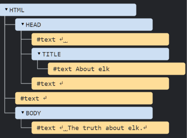

## Accessing using DOM : 

1. getElementById( )

```JavaScript
document.getElementById("box2").innerHTML="Azaan"
```

2. getElementsByClassName( )
3. 
4. getElementsByTagName( )
5. querySelector( ): It matches the first query/tag.

   ```JavaScript
   let firstParagraph = document.querySelector("p");
   console.log(firstParagraph.textContent);
   ```
6. querySelectorAll( ) : It select all the matching queries tags.


